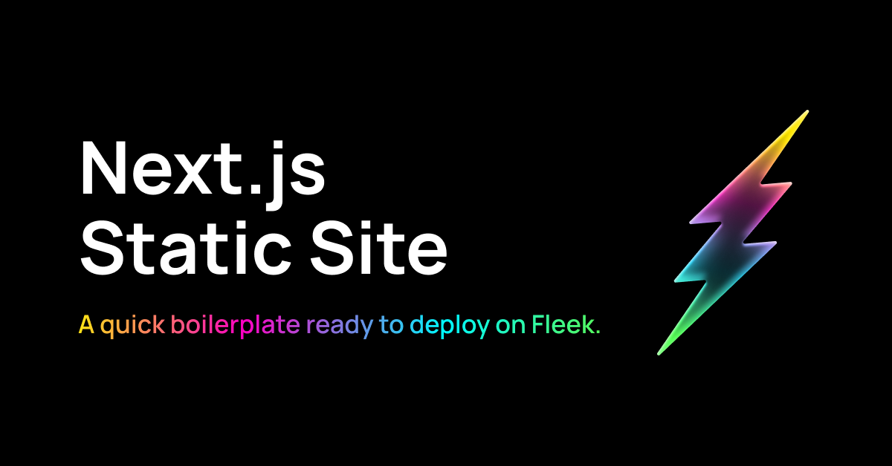

This is a [Next.js](https://nextjs.org/) project bootstrapped with [`create-next-app`](https://github.com/vercel/next.js/tree/canary/packages/create-next-app) and adapted to be instantly deployed on [Fleek](https://fleek.xyz).

## Getting Started

First, run the development server:

```bash
npm install
npm run dev
```

Open [http://localhost:3000](http://localhost:3000) with your browser to see the result.

You can start editing the page by modifying `pages/index.tsx`. The page auto-updates as you edit the file.

This project is ment to be for creating Static Sites since, at the moment, server side rendering and severless functions are not part of Fleek's solutions. Given the time if they become available this bootstrap will be updated.

## Deploy with Fleek CLI

As mentioned above you can only deploy static sites to Fleek. We have modified `next.config.js` to make sure that the site is built as a static site. You can try by running

```
npm run build
```

This will create a `out` folder with the static site. That is the folder that will be to deploy to Fleek.

To deploy this site to Fleek CLI you will first need to install the CLI from npm:

```
npm install @fleekxyz/cli
```

You need to have an account set up and you can do it by using

```
fleek login
```

Once authenticated you can initialize the site

```
fleek sites init
```

This process will create a project or choose and existing one and require some information to build the site. 

As a `dist directory` you need to set up `out` and as a `build command` you need to set up `npm run build`.

Once the process is finished you should have a `fleek.json` file in the root of the project. This file contains the information to deploy the site to Fleek. 

```json
{
  "id": "{your-site-id}",
  "name": "fleek-nextjs",
  "distDir": "out",
  "buildCommand": "npm run build"
}
```

Once this is set you can deploy your site by running

```
fleek sites deploy
```

Voialá! Your site is deployed to Fleek. To know more about the CLI you can check the [documentation](https://docs.fleek.xyz/).

